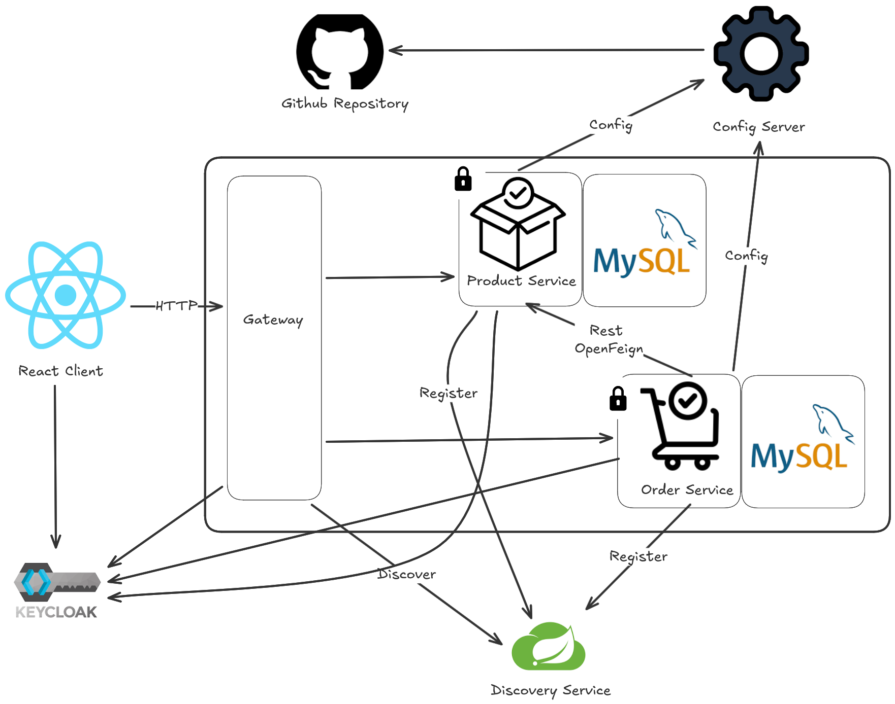
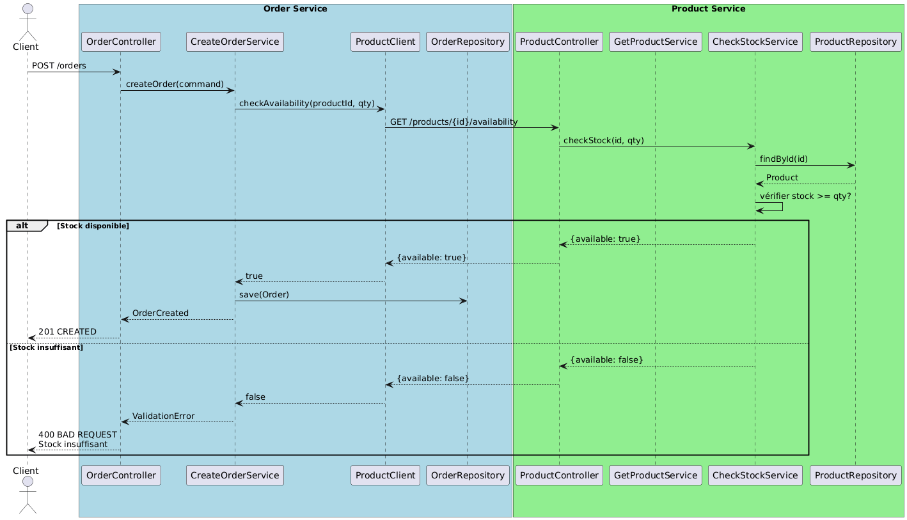
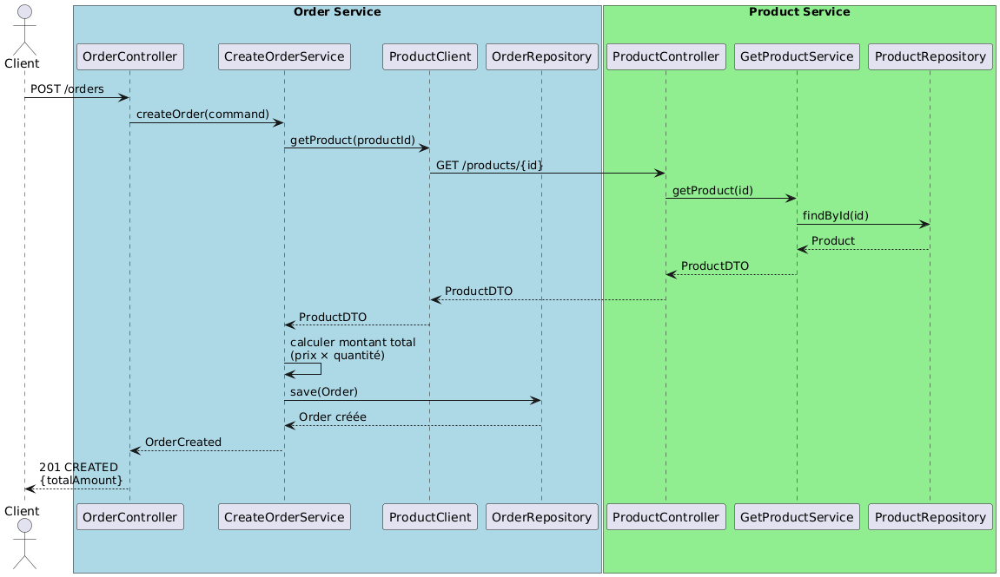
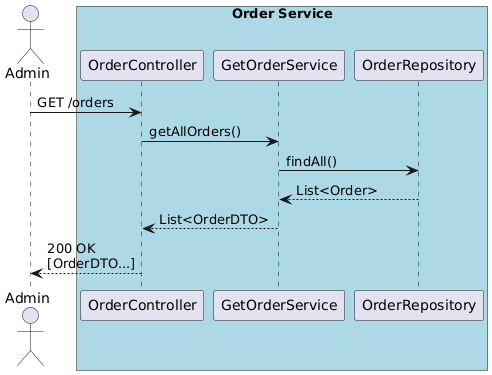
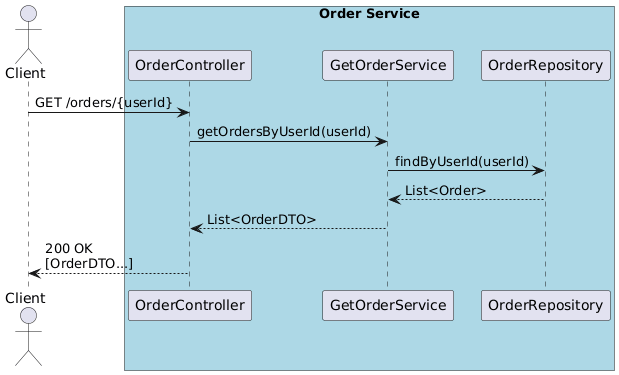
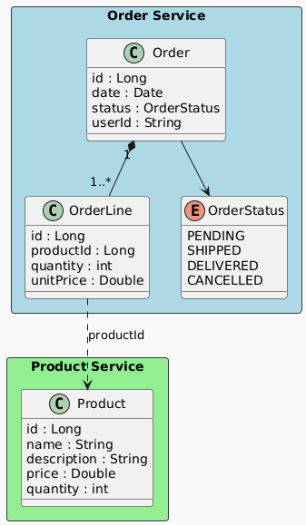

# Rapport Complet - Application Microservices

## Table des matières
1. [Vue d'ensemble du projet](#vue-densemble-du-projet)
2. [Architecture technique](#architecture-technique)
3. [Services disponibles](#services-disponibles)
4. [Flux des opérations](#flux-des-opérations)
5. [Structure des données](#structure-des-données)
6. [Installation et déploiement](#installation-et-déploiement)
7. [Documentation des APIs](#documentation-des-apis)

---

## Vue d'ensemble du projet

Ce projet est une **application microservices complète** conçue pour gérer un système de commandes de produits. L'application utilise une architecture moderne basée sur Spring Boot, avec les technologies suivantes :

- **Framework** : Spring Boot 4.0.0
- **Gestion des services** : Eureka (Service Discovery)
- **Configuration centralisée** : Spring Cloud Config Server
- **Sécurité** : OAuth2 avec Keycloak
- **Orchestration** : Docker et Docker Compose
- **Base de données** : H2 (base de données en mémoire)

### Objectifs du système
- Permettre aux utilisateurs de commander des produits
- Vérifier la disponibilité des produits
- Calculer les montants des commandes
- Gérer les commandes des utilisateurs
- Fournir une API sécurisée et scalable

---

## Architecture technique

### Diagramme d'architecture générale



**Explication :**

Cette image représente l'architecture complète de l'application microservices avec :

- **Keycloak** : Serveur d'authentification et d'autorisation OAuth2 (port 8080)
- **Config Server** : Service de configuration centralisée (port 9999)
- **Discovery Service (Eureka)** : Service de découverte des microservices (port 8761)
- **Gateway Service** : API Gateway pour router les requêtes vers les microservices (port 8888)
- **Order Service** : Microservice pour gérer les commandes (port 8082)
- **Product Service** : Microservice pour gérer les produits (port 8081)
- **Réseau Docker** : Tous les services communiquent via un réseau Docker partagé

### Flux d'authentification et autorisation

```
Client → Gateway Service → Keycloak (OAuth2) → Microservices
```

---

## Services disponibles

### 1. **Config Server**
- **Port** : 9999 
- **Rôle** : Centralise la configuration de tous les services
- **Repository** : Configuration stockée dans un dépôt Git externe
- **Propriétés principales** :
  - Configuration Eureka
  - Configuration de sécurité OAuth2
  - Paramètres spécifiques par service

### 2. **Discovery Service (Eureka)**
- **Port** : 8761
- **Rôle** : Découverte automatique des services et load balancing
- **Fonction** : Chaque microservice s'enregistre automatiquement au démarrage

### 3. **Keycloak**
- **Port** : 8080
- **Rôle** : Gestion des identités et accès (IAM)
- **Credentials** : 
  - Username : admin
  - Password : admin
- **Realm** : microservices-application

### 4. **Gateway Service**
- **Port** : 8888
- **Rôle** : Point d'entrée unique pour toutes les requêtes
- **Fonctionnalités** :
  - Routage des requêtes
  - Authentification via OAuth2
  - Load balancing

### 5. **Order Service**
- **Rôle** : Gestion des commandes
- **Fonctionnalités** :
  - Création de commandes
  - Vérification de disponibilité des produits
  - Calcul du montant des commandes
  - Consultation des commandes
  - Consultation des propres commandes d'un utilisateur
- **Base de données** : H2 (en mémoire)

### 6. **Product Service**
- **Rôle** : Gestion des produits
- **Fonctionnalités** :
  - CRUD des produits
  - Gestion de l'inventaire
  - Consultation des détails des produits
- **Base de données** : H2 (en mémoire)

---

## Flux des opérations

### Flux 1 : Commande d'un produit


**Explication :**

Ce diagramme montre la séquence complète d'une commande :

1. **Client** → **Gateway** : Envoie une requête de commande
2. **Gateway** → **Keycloak** : Vérifie l'authentification OAuth2
3. **Order Service** → **Product Service** : Vérifie la disponibilité du produit
4. **Product Service** → **Order Service** : Retourne la confirmation de disponibilité
5. **Order Service** → **Base de données** : Enregistre la commande
6. **Order Service** → **Gateway** → **Client** : Retourne la confirmation

---

### Flux 2 : Vérification de disponibilité



**Explication :**

Cette image décrit le processus de vérification de la disponibilité d'un produit :

1. Le client demande la vérification de disponibilité via la Gateway
2. L'Order Service contacte le Product Service
3. Le Product Service consulte son inventaire
4. La réponse indique si le produit est disponible ou pas
5. L'utilisateur reçoit la confirmation avant de passer sa commande

---

### Flux 3 : Calcul du montant de la commande



**Explication :**

Ce diagramme illustre le processus de calcul du montant total :

1. La commande contient les articles sélectionnés
2. Le Product Service fournit le prix de chaque produit
3. Les taxes et frais éventuels sont appliqués
4. Le montant total est calculé
5. Le montant final est retourné au client

---

### Flux 4 : Consultation des commandes



**Explication :**

Ce flux décrit comment un utilisateur peut consulter toutes les commandes du système (pour les administrateurs) :

1. **Requête** → **Gateway** → **Order Service**
2. **Order Service** consulte sa base de données
3. Retour de la liste complète des commandes
4. Affichage des détails (ID, date, montant, statut)

---

### Flux 5 : Consultation des propres commandes



**Explication :**

Ce flux montre comment un utilisateur consulte uniquement ses propres commandes :

1. **Client authentifié** → **Gateway**
2. Le Token JWT identifie l'utilisateur
3. **Order Service** filtre les commandes par ID utilisateur
4. Seules les commandes de l'utilisateur sont retournées
5. L'utilisateur voit ses commandes personnelles

---

## Structure des données

### Diagramme de classes



**Explication :**

Ce diagramme UML représente la structure complète des classes du système :

#### Classes principales :

**1. Entity Order**
- **Attributes** :
  - `orderId` : Identifiant unique de la commande
  - `userId` : Identifiant de l'utilisateur qui a passé la commande
  - `orderDate` : Date de passage de la commande
  - `totalAmount` : Montant total de la commande
  - `orderStatus` : Statut (PENDING, CONFIRMED, SHIPPED, DELIVERED, CANCELLED)
  - `orderItems` : Liste des articles de la commande (relation One-to-Many)

**2. Entity OrderItem**
- **Attributes** :
  - `itemId` : Identifiant de l'article
  - `orderId` : Référence à la commande (Foreign Key)
  - `productId` : Identifiant du produit
  - `quantity` : Quantité commandée
  - `unitPrice` : Prix unitaire au moment de la commande
  - `subTotal` : Sous-total (quantity × unitPrice)

**3. Entity Product**
- **Attributes** :
  - `productId` : Identifiant unique du produit
  - `productName` : Nom du produit
  - `description` : Description détaillée
  - `price` : Prix unitaire
  - `stock` : Quantité en stock
  - `category` : Catégorie du produit
  - `createdAt` : Date de création

**4. Entity User**
- **Attributes** :
  - `userId` : Identifiant unique
  - `username` : Nom d'utilisateur
  - `email` : Adresse email
  - `firstName` : Prénom
  - `lastName` : Nom de famille
  - `orders` : Liste des commandes (relation One-to-Many)

**5. Service Classes**
- `OrderService` : Logique métier des commandes
- `ProductService` : Logique métier des produits
- `OrderController` : API REST pour les commandes
- `ProductController` : API REST pour les produits

**Relationships** :
- Order → OrderItem (1 to Many)
- Order → User (Many to 1)
- OrderItem → Product (Many to 1)

---

## Installation et déploiement

### Prérequis
- Docker et Docker Compose
- Java 17+ (pour le développement)
- Maven 3.8+
- Git

### Démarrage avec Docker Compose

```bash
# Se placer à la racine du projet
cd microservices-application

# Lancer tous les services
docker-compose up -d

# Vérifier le statut des services
docker-compose ps
```

### Services accessibles après le démarrage

| Service | URL | Port |
|---------|-----|------|
| Keycloak | http://localhost:8080 | 8080 |
| Config Server | http://localhost:9999 | 9999 |
| Discovery Service (Eureka) | http://localhost:8761 | 8761 |
| Gateway Service | http://localhost:8000 | 8000 |
| Order Service | http://localhost:8081 | 8081 |
| Product Service | http://localhost:8082 | 8082 |

### Arrêt des services

```bash
# Arrêter et supprimer les conteneurs
docker-compose down

# Arrêter sans supprimer les données
docker-compose stop
```

### Configuration centralisée

Les propriétés de configuration sont définies dans le repository externe et incluent :

```properties
# Eureka Discovery
eureka.client.service-url.defaultZone=http://discovery-service:8761/eureka/

# OAuth2 Security
spring.security.oauth2.resourceserver.jwt.issuer-uri=http://keycloak-container:8080/realms/microservices-application

# Base de données
spring.h2.console.enabled=true

# Network
eureka.instance.prefer-ip-address=true

# Actuator (Health Check, Metrics)
management.endpoints.web.exposure.include=*
```

---

## Documentation des APIs

### Authentification

Tous les endpoints (sauf `POST /orders` pour la création initiale) nécessitent un token JWT :

```http
Authorization: Bearer <token_jwt>
```

### Order Service API

#### 1. Créer une commande
```http
POST /api/orders
Content-Type: application/json

{
  "userId": "user123",
  "items": [
    {
      "productId": "prod001",
      "quantity": 2
    }
  ]
}

Response: 201 Created
{
  "orderId": "order001",
  "userId": "user123",
  "orderDate": "2026-01-11T10:30:00Z",
  "totalAmount": 99.99,
  "orderStatus": "CONFIRMED",
  "orderItems": [...]
}
```

#### 2. Consulter toutes les commandes
```http
GET /api/orders
Authorization: Bearer <token>

Response: 200 OK
[
  {
    "orderId": "order001",
    "userId": "user123",
    "totalAmount": 99.99,
    "orderStatus": "CONFIRMED"
  }
]
```

#### 3. Consulter ses propres commandes
```http
GET /api/orders/my-orders
Authorization: Bearer <token>

Response: 200 OK
[
  {
    "orderId": "order001",
    "orderDate": "2026-01-11",
    "totalAmount": 99.99,
    "orderStatus": "CONFIRMED"
  }
]
```

#### 4. Vérifier la disponibilité d'un produit
```http
POST /api/orders/check-availability
Content-Type: application/json

{
  "productId": "prod001",
  "quantity": 5
}

Response: 200 OK
{
  "productId": "prod001",
  "available": true,
  "quantity": 5,
  "stockRemaining": 10
}
```

### Product Service API

#### 1. Lister tous les produits
```http
GET /api/products
Authorization: Bearer <token>

Response: 200 OK
[
  {
    "productId": "prod001",
    "productName": "Laptop",
    "price": 999.99,
    "stock": 15
  }
]
```

#### 2. Consulter un produit
```http
GET /api/products/{productId}
Authorization: Bearer <token>

Response: 200 OK
{
  "productId": "prod001",
  "productName": "Laptop",
  "description": "High-performance laptop",
  "price": 999.99,
  "stock": 15,
  "category": "Electronics"
}
```

#### 3. Créer un produit
```http
POST /api/products
Authorization: Bearer <token>
Content-Type: application/json

{
  "productName": "Mouse",
  "description": "Wireless mouse",
  "price": 29.99,
  "stock": 50,
  "category": "Accessories"
}

Response: 201 Created
```

#### 4. Mettre à jour le stock
```http
PUT /api/products/{productId}/stock
Authorization: Bearer <token>
Content-Type: application/json

{
  "quantity": 20
}

Response: 200 OK
```

---

## Gestion des erreurs

### Codes d'erreur courants

| Code | Description | Solution |
|------|-------------|----------|
| 400 | Requête mal formée | Vérifier le format JSON |
| 401 | Non authentifié | Fournir un token JWT valide |
| 403 | Non autorisé | Vérifier les permissions |
| 404 | Ressource non trouvée | Vérifier l'ID de la ressource |
| 500 | Erreur serveur | Consulter les logs du service |

---

